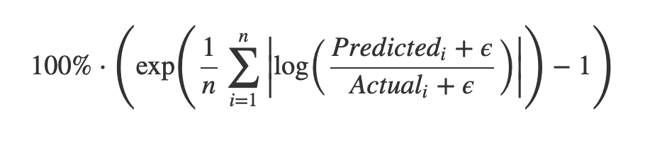

# Прогнозирование просмотров рекламных объявлений (VK CUP) 
**Автор:** Самсанович Екатерина Николаевна  

---

## Описание проекта

Проект посвящён задаче прогнозирования долей пользователей, которые увидят рекламное объявление хотя бы 1, 2 или 3 раза в будущем временном периоде.  
Данные основаны на соревновании **VK Ads Auction Forecasting Challenge**. Модель должна предсказывать значения целевых метрик `at_least_one`, `at_least_two` и `at_least_three` для набора объявлений (`validate.tsv`) с оценкой качества по Smoothed Mean Log Accuracy Ratio (метрика измеряет относительное отклонение прогноза от реальности). :contentReference[oaicite:0]{index=0}

---

## Цель проекта

- Провести EDA.  
- Подготовить признаки (feature engineering) для моделей.  
- Обучить модели с multi‑output regression для предсказания трёх целевых метрик.  
- Сравнить качество предсказаний и интерпретировать результаты.

---

## Данные

### Наборы данных

| Файл | Описание |
|------|----------|
| `users.tsv` | Информация о пользователях (пол, возраст, город) |
| `history.tsv` | История показов объявлений |
| `validate.tsv` | Валидационный датасет с объявлениями |
| `validate_answers.tsv` | Целевые значения для валидации |
| `parquet_files/` | Преобразованные данные в Parquet |

Данные представлены в формате TSV с заголовками.

---

## Структура репозитория

project_25/
├── data/ # Исходные tsv файлы
├── parquet_files/ # Оптимизированные parquet
├── model/ # Веса выбранной модели
├── 01_eda.ipynb # Исследовательский анализ данных (EDA)
├── 02_feature_eng.ipynb # Feature Engineering
├── 03_model.ipynb # Построение и обучение моделей
├── README.md # Документация проекта


---

## Этапы проекта

### 1. Исследовательский анализ данных (EDA)

Анализ распределений целевых переменных, пропусков, категорий (пол, возраст, город), частот показов, CPM, взаимодействий пользователя с площадками. Визуализация ключевых признаков и целевых значений.

---

### 2. Feature Engineering

Подготовка признаков:
- Обработка категориальных признаков (`sex`, `city_id`, `publisher`) — one‑hot encoding / embeddings для DL.
- Агрегированные признаки истории просмотров (`history.tsv`): число показов, средний CPM, временные признаки (час, сессии).
- Нормализация числовых признаков.

---

### 3. Построение модели

!!
---

### 4. Обучение и валидация

- Разделение данных на train / validation.
- Обучение моделей с оптимизацией MSE/RMSE, оценка по Smoothed Mean Log Accuracy Ratio.
- Сохранение лучшей модели в папке `model/`.

---

## Метрика оценки

Задача оценивается по метрике, которая считается значениям из всех трех колонок –`at_least_one`, `at_least_two` и `at_least_three`.
Smoothed Mean Log Accuracy Ratio, переведенная в проценты.

$$ 100\% \cdot \left( \exp \left( \frac{1}{n} \sum_{i=1}^{n}\left|\log\left(\frac{ Predicted_i + \epsilon}{Actual_i + \epsilon}\right)\right| \right) - 1 \right) $$

$\epsilon = 0.005$



EPS = 0.005

Метрика интерпретируется следующим образом: это среднее значение относительного расхождения эталона и предсказанного значения в процентах. 

Например, значение 30% значит, что в среднем модель ошибается на 30% от реальности. Чем ближе метрика к 0 – тем лучше.

---

## Как запустить проект

1. Клонировать репозиторий:  
```bash
   git clone -b project_25 https://github.com/Katrysechka/dl.25.git
   cd dl.25

2. Установить зависимости (см. `requirements.txt`):  
```bash
    pip install -r requirements.txt


3. Запустить ноутбуки в порядке:
- `01_eda.ipynb`
- `02_feature_eng.ipynb`
- `03_model.ipynb`

---

## Результаты

По результатам обучения лучшей моделью, прогнозирующей значения `at_least_one`, `at_least_two`, `at_least_three` с устойчивыми значениями Smoothed Mean Log Accuracy Ratio (тестовые результаты представлены в ноутбуке 03_model.ipynb) стала Catboost.

---

## Возможные улучшения

- Применить специализированные архитектуры для последовательных данных (например, RNN / Transformer для сессий).
- Использовать предобученные эмбеддинги для категорий.
- Экспериментировать с балансировкой классов и дополнительным feature engineering.

